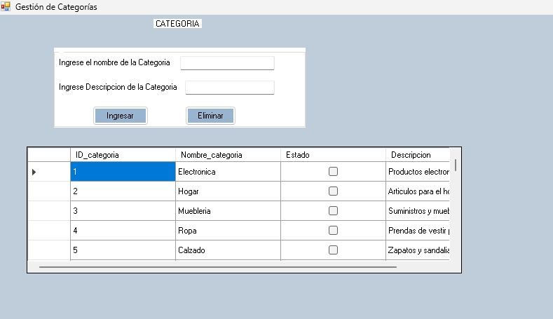
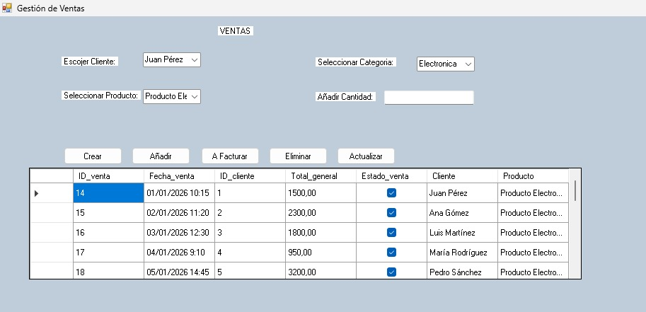
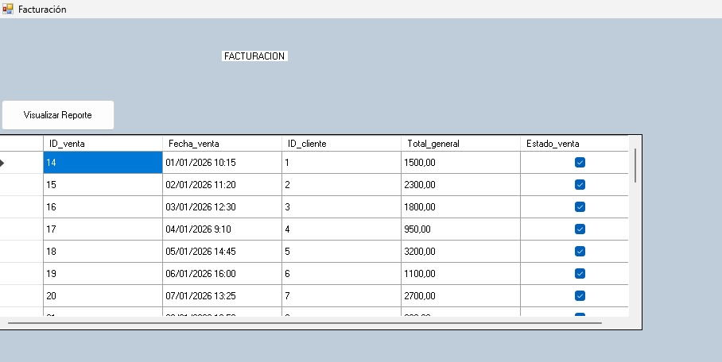

# sistema ventas 
## Vista del Proyecto 
Nombre del Proyecto: 
SISTEMA VENTAS 

 Descripcion:  
 este es elproyecto de sistema ventas en el cual se muestran laa diferentes capas del proyecto asi mismo los forms.Desing donde se muestran los eventos que hace el proyecto.  

 Herramientas Utilizadas: 
  
 Lenguaje(s): C# 
 
Herramientas/Framework:  
Framework.NET 

Base de Datos:  
SQLSERVER/BASE DE DATOS: Ventas 

  

Producto: 

Muestra lo que es el apartado de producto en el cual se pueda registrar o eliminar un producto mediante los campos y botones que aparecen en pantalla asi mismo los campos poseen validacion por lo que si no se indica un campo correctamente no se podra ingresar un Producto, cada Boton hace la asignacion que pone su nombre. 
 

 

Categoria:  
 
Muestra lo que es el apartado de Categoria y aqui se puede las categorias existentes junto con su descripcion asi mismo si el usuario necesita pueda insertar, actualizar o eliminar una categoria mediante los botones que aparecen en pantalla los cuales son uno de insertar que al momento seleccionar una categoria puede cambiar a actualizar si el usuario desea cambiar una categoria y esta tambien el boton eliminar para que el usuario pueda eliminar una categoria. 
  

Venta: 

Muestra la creacion y registro de una venta en este formulario y asi mismo muesta ventas registradas con anterioridad una muestra se registra mediante los datos que pide el formulario y se puede facturar la venta una vez se haya creado en el boton A Facturar, tambien se puede eliminar una Venta si el usuario lo requiere.   
 

Facturacion:  
Aqui se muetra el Registro de ventas realizadas almacenadas como facturas las cuales el usuario puede visualizar y seleccionar para ver el Reporte de esa Factura y los Datos correspondientes. 
 

Contexto Academico 

- Nivel: Secundaria Técnico Profesional
-  - Módulo Formativo: Desarrollo de Aplicaciones
- - Curso / Sección: 5ToD2 Informatica
- - Año escolar: 2025-2026

 Autor: 
Denyer Mojica Luis
